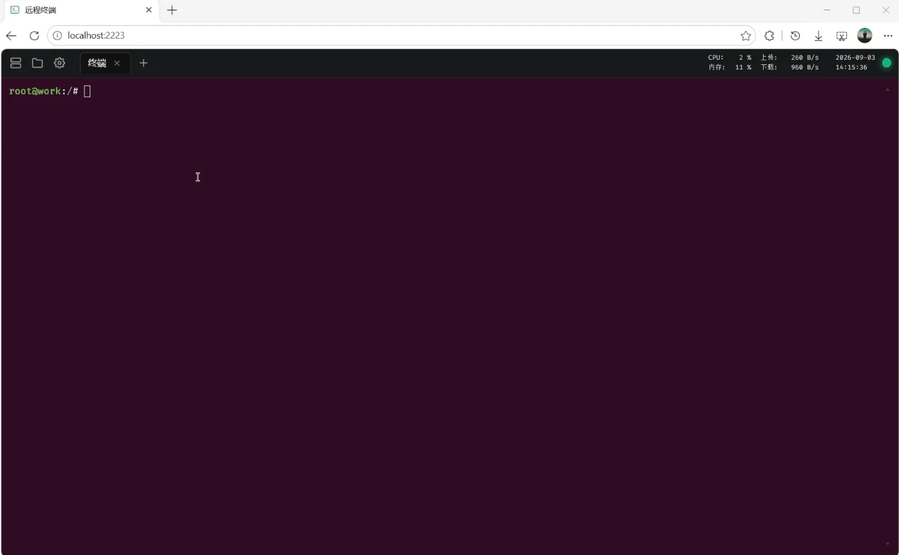

# sshweb

浏览器即用的 **Web SSH 终端 + 远程文件管理**,单二进制交付,聚焦个人远程运维:

- **多标签页终端**(可拖拽排序,刷新/断网重连同 key 回到同一会话)
- 连接**远程 SSH 服务器**(密码 / 密钥认证,支持 HTTP/SOCKS5 代理与跳板机链)
- 内置**文件管理**(SFTP / 服务端本地),带语法高亮编辑器(编码转换 / 行 diff)、拖放上传下载
- 顶部**服务器状态栏**(CPU / 内存 / 上/下行速率 / 时间)
- 可选 **SOCKS5 入站隧道**(把远程内网服务映射到本机端口)
- 前后端打进**单个可执行文件**(`rust-embed` 内嵌前端),运行时无额外依赖

<p align="center">
  
</p>

> Linux/WSL 构建部署。Windows 原生编译不支持(`tokio::signal::unix` / PTY 驱动)。

## 构建

要求:[Rust 1.97+](https://rust-lang.org/)(`rustfmt` 需 nightly)、[Node v22](https://nodejs.org/)。

```bash
# 1. 构建前端(产出 build/,编译时嵌入二进制)
npm install
npm run build

# 2. 编译服务端(单二进制 ./target/release/sshweb)
cargo build --release --bin sshweb
```

**静态可移植版**(推荐部署到旧 glibc 机器,如 CentOS 7 / Debian buster):

```bash
rustup target add x86_64-unknown-linux-musl
cargo build --release --target x86_64-unknown-linux-musl --bin sshweb
# 产出全静态二进制,无任何 glibc 依赖,可拷到任意 Linux
```

## 运行

```bash
./sshweb                                        # 默认监听 [::]:2223
./sshweb -p 2223                                # 指定端口
./sshweb --listen 0.0.0.0 -p 2223               # 仅 IPv4
./sshweb -d --log /tmp/sshweb.log               # 后台运行
./sshweb --tls-cert server.crt --tls-key server.key -p 8443   # HTTPS
```

打开 http://localhost:2223 即得终端。

**首次访问**:服务端启动时向日志打印一次性「安装密钥」,浏览器用它登录后**强制设置访问密码**(≥6 位)。
访问密码同时加密服务端配置:`./sshweb-config.enc`(程序运行目录,Argon2 派生密钥 + AES-256-GCM,0600),
含全部 SSH 服务器与私钥。登录经 HttpOnly Cookie 建立,有效期 30 天;重启服务需重新登录。

默认本地 shell 取启动环境的 `$SHELL`,未设置则 `/bin/bash`;远程 shell 由远端决定。

### 后台运行与日志

```bash
./sshweb -d                                    # fork+setsid,日志 ./sshweb.log
./sshweb -d --log /tmp/sshweb/server.log       # 指定日志文件
./sshweb status                                # 配置状态(路径/是否设密码/计数)
```

### 配置备份 / 迁移(CLI,不经 HTTP)

```bash
./sshweb version                                # 版本
./sshweb export -o backup.enc                   # 导出完整加密配置(含 SSH 私钥,密文内)
./sshweb import backup.enc                      # 导入并替换(跨机迁移用原访问密码登录)
echo 密码 | ./sshweb keys                       # 列出已存密钥
echo 密码 | ./sshweb servers                    # 列出已配置服务器(不含密码)
./sshweb reset-password                         # 重置访问密码(保留全部配置)
```

## 开发

热更新前端(后端 2223 在前,vite 代理 `/api` 到 `[::1]:2223`):

```bash
cargo run --bin sshweb -- --listen 127.0.0.1 -p 2223
npm run dev        # http://localhost:5173
```

校验:

```bash
cargo +nightly fmt --check && cargo check --workspace && cargo test --workspace
npm run check && npm run lint && npm run build
```

## 部署

`sshweb` 单二进制同时服务静态前端。可在任意 Linux/WSL 机器直接运行,或置于反向代理(nginx)后终结 TLS;
亦可用内置 `--tls-cert/--tls-key` 直启 HTTPS(此时 Cookie 加 `Secure` + HSTS)。

## 贡献

本项目源自 [sshx](https://github.com/ekzhang/sshx)(Eric Zhang)并大幅裁剪改造:移除了协作共享、端到端加密、
gRPC、mesh 分布式等能力,重写聚焦于个人远程运维的 Web SSH 终端与文件管理。特此致谢上游 sshx 项目及其作者。
